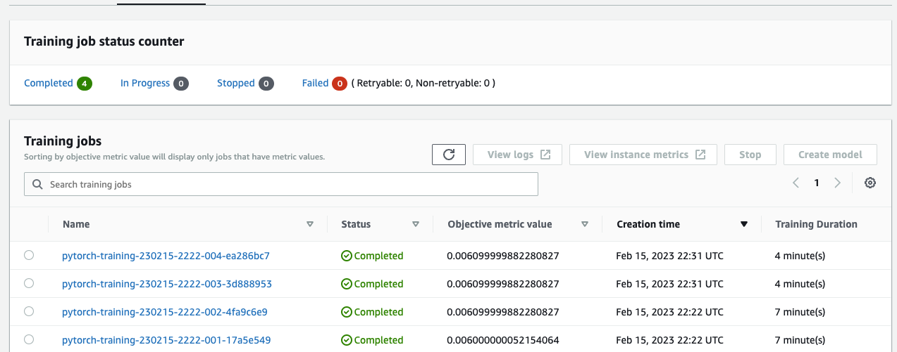
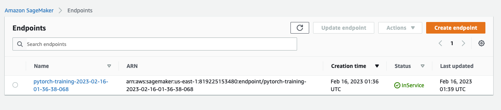

# Image Classification using AWS SageMaker

Use AWS Sagemaker to train a pretrained model that can perform image classification by using the Sagemaker profiling, debugger, hyperparameter tuning and other good ML engineering practices. This can be done on either the provided dog breed classication data set or one of your choice.

## Project Set Up and Installation
Enter AWS through the gateway in the course and open SageMaker Studio. 
Download the starter files.
Download/Make the dataset available. 

## Dataset
The provided dataset is the dogbreed classification dataset which can be found in the classroom.
The project is designed to be dataset independent so if there is a dataset that is more interesting or relevant to your work, you are welcome to use it to complete the project.

### Access
Upload the data to an S3 bucket through the AWS Gateway so that SageMaker has access to the data. 

## Hyperparameter Tuning
What kind of model did you choose for this experiment and why? Give an overview of the types of parameters and their ranges used for the hyperparameter search

I used transfer learning on the RESNET18 model for simplicty.
The main hyperparameters I tuned were the learning rate and the training batch size

## Debugging and Profiling

I applied debugging and profiling hooks to the training job so that it would report on issues live during the training

### Results

I noticed relative underutilization of the GPU instance in the profiler report. I also noticed unusual behavior in the movement of Cross-entropy as the model trained

## Model Deployment

The model is deployed on a Sagemaker endpoint, and can be queried from within sagemaker by passing an image to it through Boto3, or through a Batch Transform job.

